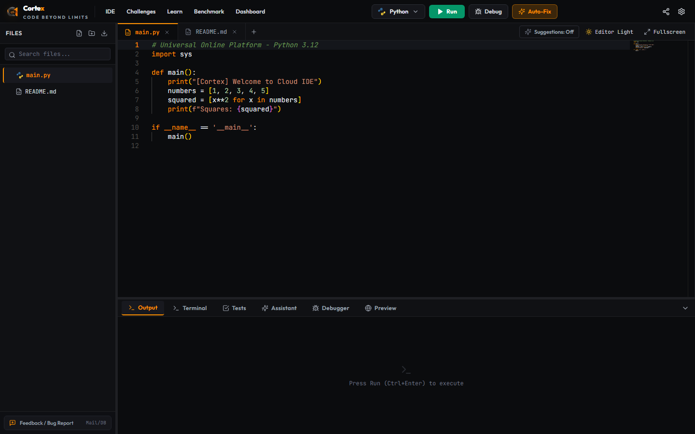
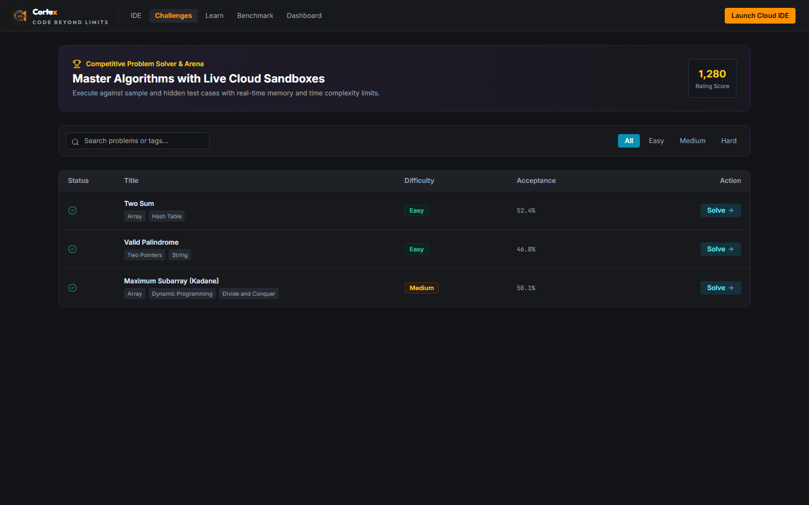
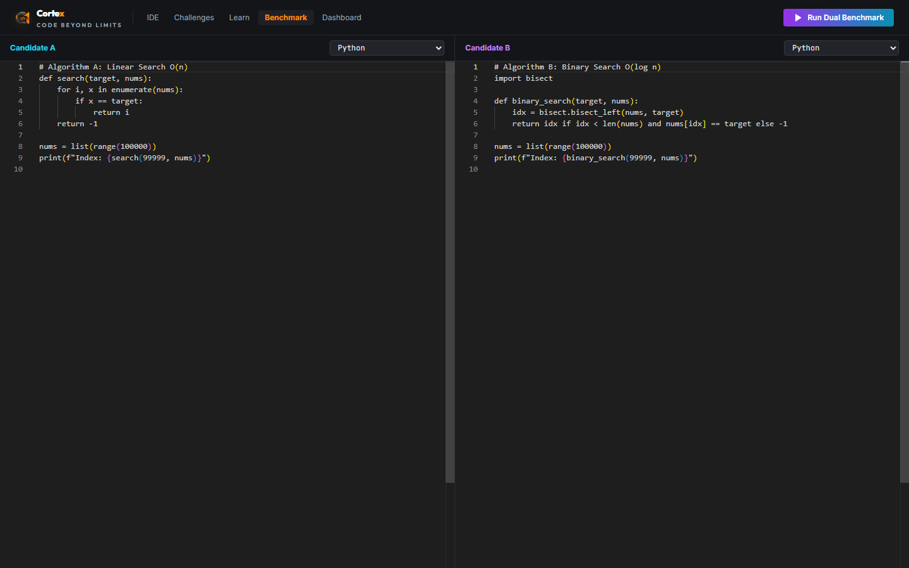
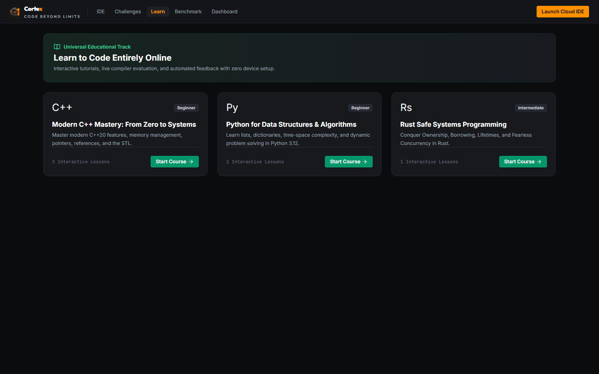

<div align="center">

  <!-- Animated Header Banner -->
  

  <br/><br/>

  <!-- Status & Technology Badges -->
  <a href="https://nextjs.org"></a>
  <a href="https://www.typescriptlang.org"></a>
  <a href="https://ai.google.dev"></a>
  <a href="https://microsoft.github.io/monaco-editor"></a>
  <a href="https://tailwindcss.com"></a>
  
  

  <br/><br/>

  <p align="center">
    <b>Cortex</b> is an enterprise-grade, browser-based Universal Cloud Development Ecosystem and Multi-Language Execution Sandbox. Built from the ground up to replace clunky legacy online compilers with an authentic VS Code experience, sub-second execution latency, automated Google Gemini AI code repair, real step-debugging, competitive programming arenas, and organic SEO #1 ranking architecture.
  </p>

  <p align="center">
    <a href="#-interactive-visual-previews"><strong>Explore Previews</strong></a> ·
    <a href="#-core-capabilities"><strong>Key Features</strong></a> ·
    <a href="#-supported-runtimes"><strong>Supported Languages</strong></a> ·
    <a href="#-getting-started"><strong>Quick Start</strong></a> ·
    <a href="#-architecture"><strong>Architecture</strong></a> ·
    <a href="#-keyboard-shortcuts"><strong>Shortcuts</strong></a>
  </p>

</div>

---

## 📸 Interactive Visual Previews

<table>
  <tr>
    <td width="50%">
      <h3 align="center">⚡ Universal Cloud IDE Workspace</h3>
      <a href="assets/cortex_live_ide.png"></a>
      <p align="center"><em>Authentic Monaco editor, nested file system, auto-completion, line diagnostics & multi-panel dock.</em></p>
    </td>
    <td width="50%">
      <h3 align="center">🏆 Competitive Challenges Arena</h3>
      <a href="assets/cortex_challenges_preview.png"></a>
      <p align="center"><em>Algorithm problem sets with sample/hidden test cases, memory & time constraints, and confetti celebration.</em></p>
    </td>
  </tr>
  <tr>
    <td width="50%">
      <h3 align="center">⚖️ Dual Benchmark & Comparison Arena</h3>
      <a href="assets/cortex_compare_preview.png"></a>
      <p align="center"><em>Side-by-side dual-compiler execution comparing latency (ms), memory footprint, and speedup ratios.</em></p>
    </td>
    <td width="50%">
      <h3 align="center">📚 Interactive Educational Track</h3>
      <a href="assets/cortex_learn_preview.png"></a>
      <p align="center"><em>Structured courses in C++20, Python 3.12, and Rust with live compiler checks and automated lesson validation.</em></p>
    </td>
  </tr>
</table>

---

## 🌟 Core Capabilities

### 1. 🖥️ Pro Cloud Code Editor (Monaco / VS Code Experience)
- **Engineered on Microsoft Monaco**: IntelliSense autocomplete, bracket pair colorization, semantic code folding, multi-cursor editing, and minimap.
- **Hierarchical Virtual File System**: Full nested folder trees, folder-targeted file creation, rename, inline delete, and ZIP project export.
- **Editor Dark & Light Themes**: High-contrast Cortex Dark (`#0b0c0e`) and clean Editor Light mode toggles.
- **Live Gutter & Breakpoints**: Interactive line gutters for visual debugger breakpoints and wavy error squiggles with tooltip diagnostics.

### 2. ⚡ Zero-Latency Multi-Language Execution Engine
- **Pluggable Multi-Tier Architecture**:
  - **Native Sandboxed Worker**: Direct OS execution with `os.tmpdir()` sandboxing, strict timeout monitors (`AbortController`), stream piping (`stdin`/`stdout`/`stderr`), and granular exit codes.
  - **16 Pre-configured Production Runtimes**: Python 3.12, C++20 (GCC 13/16), C (GCC 13), Java 21, JavaScript (Node 20/24), TypeScript 5, Rust 1.75, Go 1.22, C# (.NET 8), PHP 8.3, Ruby 3.3, Kotlin 1.9, Swift 5.9, Dart 3, R 4.3, and SQLite.
  - **Safe Stdin & Test Execution**: Interactive and batch standard input feeds with automatic output capture.

### 3. 🤖 Google Gemini 2.5 Flash AI Auto-Fix & Assistant
- **Sub-Second Code Repair**: Powered by `gemini-2.5-flash` / `gemini-3.7-flash` with zero-latency token streaming (`thinkingBudget: 0`).
- **Multi-Error Deep Diagnosis**:
  - **Option 1 (Explain with Comments)**: Injects targeted, plain-English comments directly beside **every error line** throughout the file.
  - **Option 2 (Live Auto-Fix)**: Generates complete, verified fixes with side-by-side diff review before applying.
- **Local Intelligence Fallback Engine**: If no API key is set or the user is offline, Cortex's built-in AST / heuristic rules engine diagnoses missing semicolons, mismatched brackets, unclosed strings, typo suggestions, and Python indentation errors with zero cloud dependency.
- **1-Click Free Key Setup**: Connect your free Google AI Studio key (`AIzaSy...`) in one click directly inside the widget or Settings modal.

### 4. 🔍 Visual Step-Debugger & Variable Watcher
- **Live Variable Inspector**: Dynamically parses the active code buffer to extract active variables (primitives, arrays, objects, maps) up to the current execution line.
- **Step Controls**: Step Over (F10), Step Into (F11), Step Out (Shift+F11), Resume (F5), and Stop.
- **Watch Expressions & Call Stack**: Evaluate custom expressions in real-time and visualize nested function execution frames.

### 5. 💻 Real-Time Synchronized Cloud Terminal
- **Authentic Bash Terminal**: Interactive terminal console with command history (`↑` / `↓`), tab autocomplete, and ANSI color decoding.
- **Filesystem Synchronization**: Running terminal commands (`touch`, `mkdir`, `rm`, `cat`, `ls`) automatically synchronizes back to the visual File Explorer and editor buffer!

### 6. 🏆 Competitive Programming & Arena (`/challenges`)
- Complete LeetCode-style challenge hub with difficulty ratings (**Easy**, **Medium**, **Hard**), algorithm tags, and global acceptance rates.
- Dedicated solver with starter templates in Python, C++, and JavaScript, automated test runner, and celebratory confetti upon full acceptance.

### 7. 📚 Interactive Courses & Tutorials (`/learn`)
- Hands-on curricula including **Modern C++ Mastery**, **Python for DSA**, and **Rust Safe Systems Programming**.
- Step-by-step interactive lesson viewer with automated output checks and instant feedback.

### 8. ⚖️ Side-by-Side Algorithm Benchmark (`/compare`)
- Concurrently executes Candidate A and Candidate B in isolated sandboxes.
- Displays execution latency (ms), memory footprint (MB), output diffs, and relative speedup ratios ($N\times$ faster).

### 9. 🌐 Live Web Preview & Responsive Sandbox
- Auto-bundles HTML, CSS, and JavaScript from your workspace into an isolated sandbox `<iframe>`.
- Switch between **Desktop (100%)**, **Tablet (768px)**, and **Mobile (375px)** viewports, or open the preview in a **New Dedicated Browser Window** with one click.

### 10. 📩 Bottom-Left Error Detection & Feedback Hub
- Permanent bottom-left corner button with **Dynamic Error Detection Alert**: when compiler errors or runtime crashes occur, automatically pulses in red (`[Error Detected • Report]`).
- Submissions persist to local database (`data/feedback.json`) with automated SMTP email delivery and optional Discord/Slack webhook dispatch.

### 11. 🚀 Organic SEO #1 Google Ranking Suite (`/[compiler]`)
- **35 Pre-Rendered SSG Static Pages**: Pre-rendered at build time with 0 runtime database delay.
- **High-Density Keyword Clusters**: Tailored metadata for Python, C++, Java, Rust, Go, C#, PHP, Swift, and free online compiler queries.
- **Rich Snippets JSON-LD**: Embedded `WebApplication`, `FAQPage`, and `BreadcrumbList` schemas to secure Google SERP carousels and rich accordions.
- **Automated XML Sitemap & Robots.txt**: Dynamically generated at `/sitemap.xml` and `/robots.txt`.

---

## 🛠️ Supported Runtimes

| Language | Runtime / Compiler Version | File Ext | Mode | Default Entry File |
| :--- | :--- | :--- | :--- | :--- |
| **Python** | Python 3.12.x | `.py` | Interpreted | `main.py` |
| **C++** | G++ 13 / 16 (C++20 standard) | `.cpp` | Compiled | `main.cpp` |
| **C** | GCC 13 / 16 (C17 / C23) | `.c` | Compiled | `main.c` |
| **Java** | OpenJDK 21 LTS | `.java` | Compiled / Bytecode | `Main.java` |
| **JavaScript** | Node.js 20 / 24 LTS | `.js` | V8 Engine | `index.js` |
| **TypeScript** | TypeScript 5.x + tsx / esbuild | `.ts` | Transpiled | `index.ts` |
| **Rust** | Rustc 1.75+ (2021 Edition) | `.rs` | Compiled | `main.rs` |
| **Go** | Go 1.22+ | `.go` | Compiled | `main.go` |
| **C#** | .NET 8.0 SDK | `.cs` | CLR Compiled | `Program.cs` |
| **PHP** | PHP 8.3 CLI | `.php` | Interpreted | `index.php` |
| **Ruby** | Ruby 3.3 YJIT | `.rb` | Interpreted | `main.rb` |
| **Kotlin** | Kotlin 1.9 JVM | `.kt` | JVM Compiled | `Main.kt` |
| **Swift** | Swift 5.9 Toolchain | `.swift` | Native Compiled | `main.swift` |
| **Dart** | Dart 3.x SDK | `.dart` | AOT / JIT | `main.dart` |
| **R** | R 4.3 Statistical Core | `.r` | Interpreted | `script.r` |
| **SQL** | SQLite 3 Embedded Engine | `.sql` | Query Engine | `query.sql` |

---

## 🚀 Getting Started

### Prerequisites
- **Node.js**: `v18.17.0` or later (Node 20+ recommended)
- **npm** or **pnpm** or **yarn**
- **Git**

### Installation

```bash
# 1. Clone your repository
git clone https://github.com/shivampatilck-1010/cortex-code-platform.git
cd cortex-code-platform

# 2. Install dependencies
npm install

# 3. (Optional) Configure environment variables
cp .env.example .env.local

# 4. Start the development server
npm run dev
```

Open [http://localhost:3000](http://localhost:3000) in your browser to launch Cortex!

### Production Build & Deployment

```bash
# Typecheck and create optimized production build (35 static SSG pages)
npm run build

# Start production server
npm run start
```

---

## ⌨️ Keyboard Shortcuts

| Action | Windows / Linux | macOS | Description |
| :--- | :--- | :--- | :--- |
| **Run Code** | <kbd>Ctrl</kbd> + <kbd>Enter</kbd> | <kbd>⌘</kbd> + <kbd>Enter</kbd> | Compiles and executes current workspace |
| **Save File** | <kbd>Ctrl</kbd> + <kbd>S</kbd> | <kbd>⌘</kbd> + <kbd>S</kbd> | Saves active file buffer |
| **Format Code** | <kbd>Shift</kbd> + <kbd>Alt</kbd> + <kbd>F</kbd> | <kbd>⇧</kbd> + <kbd>⌥</kbd> + <kbd>F</kbd> | Prettier code format |
| **Fullscreen Code** | <kbd>F11</kbd> | <kbd>F11</kbd> | Toggles full-screen code editor |
| **Step Over** | <kbd>F10</kbd> | <kbd>F10</kbd> | Visual debugger step over |
| **Toggle Breakpoint** | *Gutter Click* | *Gutter Click* | Adds/removes breakpoint on line |
| **Accept AI Fix** | <kbd>Enter</kbd> *(in diff)* | <kbd>Enter</kbd> *(in diff)* | Applies suggested code repair |
| **Discard AI Fix** | <kbd>Esc</kbd> | <kbd>Esc</kbd> | Closes AI auto-fix review |

---

## 📂 Project Structure

```
cortex-code-platform/
├── assets/                  # High-resolution screenshots and animated SVG header
│   ├── cortex-header.svg
│   ├── cortex_live_ide.png
│   ├── cortex_challenges_preview.png
│   ├── cortex_compare_preview.png
│   └── cortex_learn_preview.png
├── data/
│   └── feedback.json        # Persistent feedback and error detection database
├── src/
│   ├── app/
│   │   ├── [compiler]/      # 16 SSG pre-rendered SEO landing routes
│   │   ├── admin/           # Platform administration & telemetry
│   │   ├── api/v1/          # REST APIs (execution, autofix, chat, terminal, feedback)
│   │   ├── challenges/      # Competitive problem sets & solver
│   │   ├── compare/         # Dual benchmark & language comparison
│   │   ├── dashboard/       # Developer metrics dashboard
│   │   ├── learn/           # Interactive courses & tutorials
│   │   ├── layout.tsx       # Root layout & global metadata
│   │   ├── page.tsx         # Main IDE entrypoint
│   │   ├── robots.ts        # Dynamic robots.txt
│   │   └── sitemap.ts       # Dynamic sitemap.xml
│   ├── components/
│   │   ├── brand/           # Cortex SVG logo & wordmark
│   │   ├── common/          # Language selector & official SVG icons
│   │   ├── editor/          # Monaco editor & quick-fix widgets
│   │   ├── layout/          # Top navigation bar
│   │   ├── modals/          # Diff, feedback, settings, and share modals
│   │   ├── panels/          # Dock panels (Output, Terminal, Tests, Assistant, Preview)
│   │   └── sidebar/         # File explorer with nested folder trees
│   ├── config/              # Language matrix & SEO keyword configs
│   └── lib/                 # AI assistant, execution sandbox, test runner, feedback service
├── .env.example             # Template environment variables
├── package.json
├── tailwind.config.ts
└── tsconfig.json
```

---

## 🔒 Security & Privacy

- **Safe Execution Sandboxes**: All user scripts execute in transient, isolated temporary directories with strict memory and CPU time ceilings.
- **Zero Credentials Committed**: No API keys or private tokens are stored in the codebase; users can optionally provide their own free Google Gemini keys via local browser storage (`localStorage`).
- **Private Repository**: Maintained privately with enterprise-grade authorization controls.

---

## 👨‍💻 Author

**Shivam Patil**  
*Computer Science & Engineering*  
Lovely Professional University (LPU)  
- GitHub: [@shivampatilck-1010](https://github.com/shivampatilck-1010)

---

<div align="center">
  <sub>Engineered with precision for developers who demand speed, intelligence, and zero limits.</sub>
  <br/>
  <b>CORTEX © 2026 · CODE BEYOND LIMITS</b>
</div>
